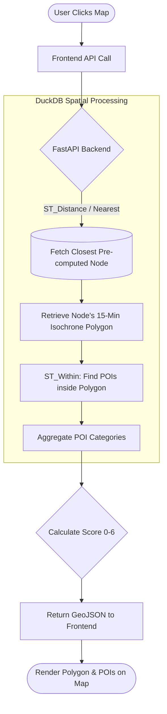
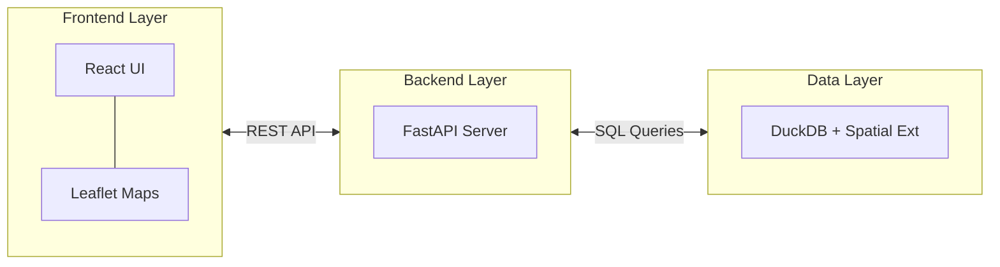

# 15-Minute City Auditor: Quantifying Urban Accessibility

> [!NOTE]
> **Abstract**
> The "15-Minute City" is an urban planning concept where essential services (groceries, healthcare, education, parks) are accessible within a 15-minute walk or cycle from any given point. This project is a global spatial analytics and visualization tool designed to audit urban areas worldwide. For this demonstration, we use Pune, Maharashtra as a case study. By leveraging graph-based network routing and spatial database queries, the 15-Minute City Auditor calculates realistic walking catchment areas (isochrones) and scores neighborhoods based on their proximity to basic daily needs, shifting the perspective from geographical distance to true human accessibility.

---

## 🎯 Objective
- **Measure True Accessibility:** Move beyond straight-line "as-the-crow-flies" distance and calculate realistic walking times based on actual street networks.
- **Identify Infrastructure Gaps:** Highlight neighborhoods that lack essential amenities, providing data-driven insights into urban inequality.
- **Interactive Visualization:** Provide citizens and planners with an interactive web interface to explore walkability scores, view isochrones, and discover nearby Points of Interest (POIs).
- **Technical Demonstration:** Showcase a modern, lightweight spatial stack using DuckDB's spatial extension for fast, on-the-fly geospatial processing without the overhead of traditional GIS databases.

---

## ⚙️ Methodology & Workflow

The system models the city as a network of nodes and edges (roads). For a given location, it calculates a 15-minute walking boundary, cross-references it with POI data, and assigns an accessibility score.

---

## 📊 Result Analysis (Pune Case Study)

The auditor evaluates neighborhoods based on the presence of 6 essential POI categories: **Grocery, Healthcare, Pharmacy, School, Park, and Public Transport**. By overlaying the Kontur Population density grid with walkability scores, we determine the actual human impact of urban accessibility.

| Score | Walkability Level | Population Impact | Description |
| :---: | :--- | :--- | :--- |
| **0** | Car Dependent | **47.0%** (5.74M) | No basic services nearby. |
| **1-2** | Poor | **8.5%** (1.03M) | Missing most essentials. |
| **3-4** | Average | **16.1%** (1.96M) | Lacking healthcare/transit. |
| **5** | Good | **10.7%** (1.30M) | Nearly a complete neighborhood. |
| **6** | **True 15-Min City** | **17.7%** (2.15M) | All needs met. |

> [!TIP]
> **The "Aha!" Moment:** While only **2.5%** of Pune's land area achieves a perfect Score 6, its high density means it successfully houses **17.7%** of the total population!

---

## 🏗️ System Architecture

The project is containerized using Docker and follows a decoupled client-server architecture, relying on DuckDB for heavy geospatial lifting.

- **Frontend:** React + Vite, deployed on Nginx. Uses Leaflet for rendering GeoJSON map layers.
- **Backend:** Python + FastAPI. Exposes endpoints for nodes, isochrones, and POI summaries.
- **Database:** DuckDB with the Spatial Extension (`accessibility.duckdb`). Handles `ST_Distance` and `ST_Within` queries locally.
- **Infrastructure:** Docker Compose manages the multi-container setup for seamless deployment.

---

## 🚀 Future Scope

- **Multi-Modal Routing:** Introduce cycling and public transit catchments, not just walking.
- **Equity & Demographics:** Overlay census and demographic data to analyze whether low-income neighborhoods suffer from poorer accessibility.
- **Topography Adjustments:** Account for elevation changes (hills) which significantly affect real-world walking times.
- **Streamline Global Pipelines:** Automate the data ingestion pipeline to rapidly onboard OSM and population data for any new city worldwide.

---

## 🏁 Conclusion

The 15-Minute City Auditor effectively translates an abstract urban planning concept into a tangible, measurable, and interactive tool. By analyzing exactly what is reachable within a short walk, the project highlights the stark differences in neighborhood convenience and urban design. It proves that modern, lightweight tools like DuckDB can power complex spatial analysis, ultimately helping us rethink how our cities are built and how our daily time is spent.
